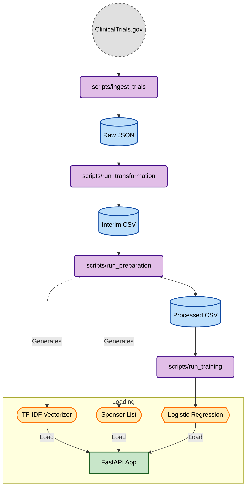

Goal

Predict the likelihood that a clinical trial will reach completion versus being terminated, using metadata from ClinicalTrials.gov

## 🏗️ System Architecture

```mermaid
flowchart TD
    %% --- Styles ---
    %% High Contrast Mode (Black Text)
    classDef storage fill:#bbdefb,stroke:#0d47a1,stroke-width:2px,color:#000;
    classDef process fill:#e1bee7,stroke:#4a148c,stroke-width:2px,rx:5,ry:5,color:#000;
    classDef artifact fill:#ffecb3,stroke:#ff6f00,stroke-width:2px,rx:5,ry:5,color:#000;
    classDef app fill:#c8e6c9,stroke:#1b5e20,stroke-width:2px,color:#000;
    classDef source fill:#e0e0e0,stroke:#616161,stroke-width:2px,stroke-dasharray: 5 5,color:#000;

    %% --- Nodes ---
    
    %% External Source
    Internet((ClinicalTrials.gov)):::source

    %% Data Stores (Blue)
    Raw[(Raw JSON)]:::storage
    Interim[(Interim CSV)]:::storage
    Processed[(Processed CSV)]:::storage
    
    %% Scripts/Processes (Purple) - UPDATED NAMES
    Ingest[scripts/ingest_trials]:::process
    Transform[scripts/run_transformation]:::process
    Prepare[scripts/run_preparation]:::process
    Train[scripts/run_training]:::process
    
    %% Artifacts (Orange/Gold)
    Vector([TF-IDF Vectorizer]):::artifact
    Sponsors([Sponsor List]):::artifact
    Model{{Logistic Regression}}:::artifact
    
    %% App (Green)
    API[FastAPI App]:::app
    
    %% --- Flow ---
    
    %% Phase 1: Ingestion & Transformation
    Internet --> Ingest
    Ingest --> Raw
    Raw --> Transform
    Transform --> Interim
    
    %% Phase 2: Preparation & Feature Engineering
    Interim --> Prepare
    Prepare --> Processed
    
    %% Artifact Generation (Side Effects)
    Prepare -.->|Generates| Vector
    Prepare -.->|Generates| Sponsors
    
    %% Phase 3: Training
    Processed --> Train
    Train --> Model
    
    %% Phase 4: Serving
    %% Using subgraph to group these inputs visually helps in vertical mode
    subgraph Load_Artifacts [Loading]
        direction LR
        Vector -->|Load| API
        Sponsors -->|Load| API
        Model -->|Load| API
    end
```