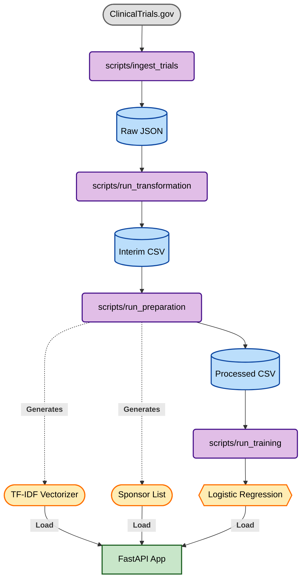

# 🏥 Clinical Trial Outcome Predictor


## 🎯 Goal
Predict the likelihood that a clinical trial will reach **Completion** versus being **Terminated**, using metadata fetched from the ClinicalTrials.gov API. This project serves as a comprehensive **End-to-End MLOps Template**, demonstrating data engineering, model training, artifact management, and API deployment.

---

## 🏗️ System Architecture



---

## ⚡ Key Features

* **Modular Pipeline:** Separation of concerns between Ingestion, Transformation, and Training.
* **Robust Preprocessing:** Handles missing values, log-transforms continuous data, and performs One-Hot Encoding/TF-IDF on categorical text.
* **Experiment Tracking:** Uses **MLflow** to log metrics (ROC-AUC, Precision, Recall) and model parameters.
* **API Serving:** Exposes the model via **FastAPI** with Pydantic validation and automatic Swagger UI documentation.
* **Containerization:** Fully Dockerized for reproducible deployment anywhere.
* **Quality Gates:** Automated data auditing and unit testing via **pytest**.

---

## 📂 Project Structure

```text
├── config/                 # YAML configuration files (paths, params)
├── data/                   # Data storage (gitignored)
│   ├── raw/                # Original JSON from API
│   ├── interim/            # Flattened CSV
│   └── processed/          # Feature-engineered CSV
├── docker/                 # Dockerfile and docker-compose.yml
├── models/                 # Saved artifacts (.pkl, .joblib)
├── scripts/                # Entry points for the pipeline (e.g., run_train.py)
├── src/                    # Source code modules
│   ├── api/                # FastAPI application & schemas
│   ├── features/           # Feature engineering logic
│   ├── inspections/        # Data quality checks & exploratory inspection logic
│   ├── pipelines/          # Core pipeline orchestration
│   └── utils/              # Helper functions (config loading, etc.)
├── tests/                  # Unit tests
├── Makefile                # Command shortcuts
└── requirements.txt        # Python dependencies
```

---

## 🚀 Getting Started

### Prerequisites
* Python 3.12+
* Docker & Docker Compose (optional, for containerization)

### Local Installation
```bash
# 1. Clone the repository
git clone [https://github.com/drew-1618/clinical-trial-outcome-predictor.git](https://github.com/drew-1618/clinical-trial-outcome-predictor.git)
cd clinical-trial-outcome-predictor

# 2. Setup Virtual Environment & Install Dependencies
make setup
```

---

## 🛠️ Usage

### 🚀 Master Commands (The "Easy Button")
Use these commands to manage the entire lifecycle in one step.

| Command | Description |
| :--- | :--- |
| **`make all`** | **Build Everything:** Runs ingestion, transformation, preparation, auditing, training, and testing in the correct order. |
| **`make clean`** | **Soft Reset Project:** Finds and deletes Python cache files, pytest cache files, and MLFlow logs. |
| **`make nuke`** | **Hard Reset Project:** Deletes all generated data (`data/raw`, `processed`, etc.) and models. Use with caution! |

---

### 1. Run the Data Pipeline
If you need to run specific stages manually:
```bash
make ingest       # Fetch Raw JSON
make transform    # Convert to CSV
make prepare      # Clean & Feature Engineer (Creates artifacts)
```

### 2. Train the Model
Trains a Logistic Regression model and logs results to MLflow.
```bash
make train
```

### 3. Docker Management (Serving)
Commands to manage the containerization API.
| Command | Description |
| :--- | :--- |
| **`make docker-run`** | Builds the image, starts the container, and opens the Swagger UI in your browser automatically. |
| **`make docker-stop`** | Stops and removes the running container (frees up port 8000). |
| **`make docker-logs`** | Tails the server logs (Press `Ctrl+C` to exit). |

### 4. Local Development (No Docker)
Starts the FastAPI server locally.
```bash
uvicorn src.api.app:app --reload
```
* **API URL:** `http://localhost:8000`
* **Documentation:** `http://localhost:8000/docs`

---

## 📡 API Reference

**Endpoint:** `POST /predict`

**Request Body:**
```json
{
  "nct_id": "NCT12345678",
  "phase": "Phase 3",
  "condition": "Non-small cell lung cancer",
  "sponsor": "Pfizer",
  "enrollment": 500
}
```

**Response:**
```json
{
  "prediction": "Success",
  "probability": 0.9372,
  "model_used": "logistic_baseline"
}
```

---

## 🧪 Testing

Run the test suite to verify API endpoints and feature engineering logic.
```bash
pytest
```
